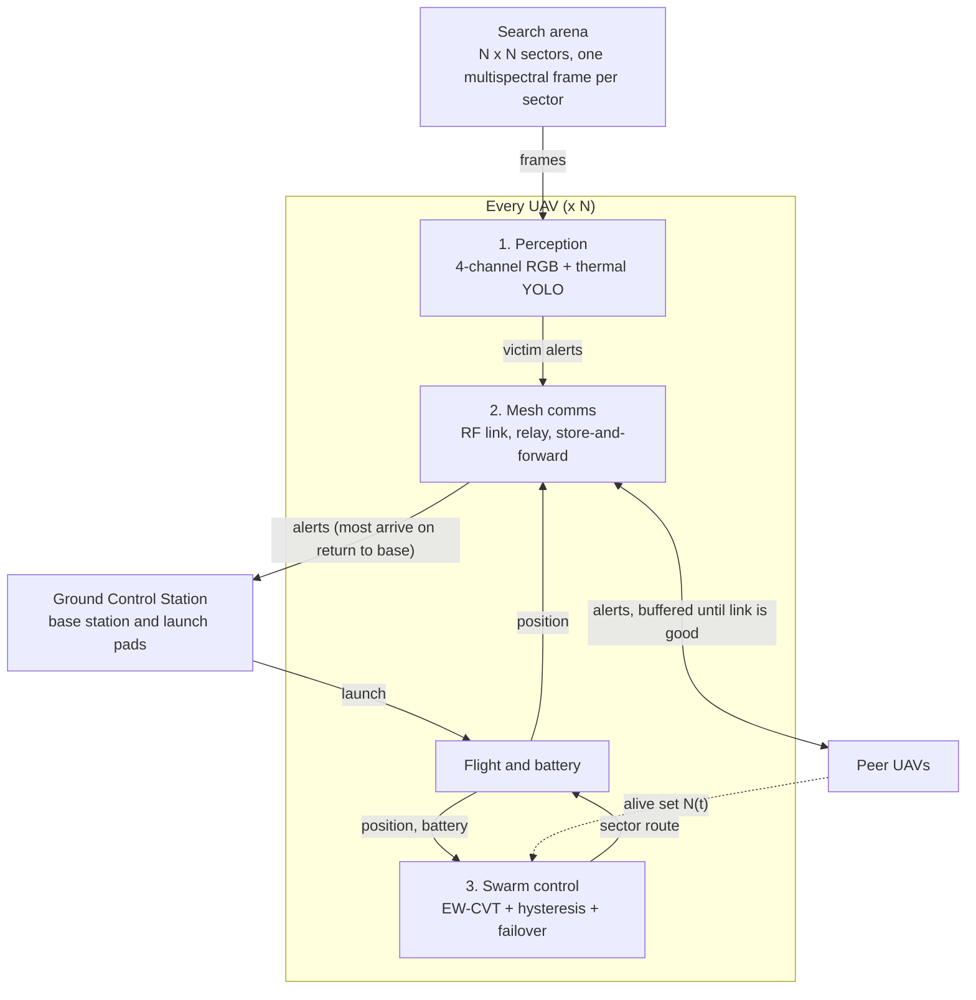

# Autonomous Multispectral UAV Swarm for Search and Rescue (SAR)

[](https://www.python.org/downloads/)
[](https://pytorch.org/)
[](https://github.com/ultralytics/ultralytics)
[](https://gradio.app/)

A simulation platform for multi-UAV search and rescue. It combines **4-channel early-fusion RGB + thermal victim detection**, a **delay-tolerant ad-hoc mesh** with RF propagation modelling, and **energy-aware swarm control** (Energy-Weighted CVT partitioning, hysteresis, and failover), with a live mission console and an ablation study that measures what each component contributes.

> **Start here:** [results](results/README.md) (ablation study, all numbers reproducible) · [architecture diagrams](docs/ARCHITECTURE_PROPOSAL.md) · [how to run](docs/HOW_TO_RUN.md)

---

## Table of Contents

- [System Architecture](#system-architecture)
- [Key Features](#key-features)
- [Results at a Glance](#results-at-a-glance)
- [Scope and Limitations](#scope-and-limitations)
- [Directory Layout](#directory-layout)
- [Installation & Setup](#installation--setup)
- [Quick Start](#quick-start)
- [Flight & Network Dynamics](#flight--network-dynamics)
- [Training & Dataset Pipeline](#training--dataset-pipeline)
- [SITL Autopilot & ns-3 Integration](#sitl-autopilot--ns-3-integration)
- [Citations & Credits](#citations--credits)

---

## System Architecture

Three contributions run on every UAV: perception, mesh communications, and swarm control. They interact through three narrow interfaces: victim alerts (perception to comms), a sector route (control to flight), and the set of live UAVs (comms to control).


```mermaid
flowchart TB
  ARENA["Search arena<br/>N x N sectors, one multispectral frame per sector"]
  GCS["Ground Control Station<br/>base station and launch pads"]

  subgraph UAV["Every UAV (x N)"]
    PERC["1. Perception<br/>4-channel RGB + thermal YOLO"]
    COMM["2. Mesh comms<br/>RF link, relay, store-and-forward"]
    CTRL["3. Swarm control<br/>EW-CVT + hysteresis + failover"]
    FLT["Flight and battery"]
    PERC -- "victim alerts" --> COMM
    CTRL -- "sector route" --> FLT
    FLT -- "position, battery" --> CTRL
    FLT -- "position" --> COMM
  end

  PEERS["Peer UAVs"]

  ARENA -- "frames" --> PERC
  GCS -- "launch" --> FLT
  COMM -- "alerts (most arrive on return to base)" --> GCS
  COMM <-->|"alerts, buffered until link is good"| PEERS
  PEERS -. "alive set N(t)" .-> CTRL
```

More diagrams (per-UAV pipeline, control loop, hysteresis gate, alert delivery, state machine, failover, module map, evaluation design) are in [`docs/ARCHITECTURE_PROPOSAL.md`](docs/ARCHITECTURE_PROPOSAL.md).

---

## Key Features

1. **4-channel early-fusion perception.**
   - Visible RGB and thermal LWIR are stacked into one 4-plane tensor and fed to a YOLO network whose first convolution takes 4 channels. The shipped model (`best.pt`) is YOLO11s trained on the NII-CU RGB-thermal drone dataset; the detector also loads the earlier YOLOv8-P2 variant.
   - The thermal kernel is initialised from the pretrained red-channel kernel; training uses no colour jitter, since a thermal channel makes it meaningless.

2. **Energy-Weighted CVT swarm control.**
   - Each UAV gets a weight `w = (B / B_max)^α` from its battery. Unscanned sectors are assigned to the UAV with the smallest power distance `‖c_s − g_i‖² / w_i`, so low-battery UAVs receive smaller territories. `α = 0` is plain Voronoi.
   - The initial partition is a converged CVT from Lloyd iterations; the partition is then recomputed every 5 s of mission time.

3. **Dual-threshold hysteresis.**
   - A UAV adopts a new territory only if its battery has dropped by at least 2 % **and** its ideal centroid has moved at least 5 m. A change in the set of live UAVs overrides both thresholds.
   - This suppresses chattering from battery-sensor noise: about 5× fewer sector flips and route changes per mission in the ablation.

4. **Autonomous failover and battery reserve.**
   - When a UAV is lost, its unscanned sectors are reassigned to the survivors. A UAV that reaches the 15 % battery reserve aborts and returns to base; at 0 % it is lost.

5. **Delay-tolerant FANET mesh.**
   - Log-distance path loss with shadow fading maps distance to SNR and packet error rate. Failed alerts wait in per-recipient QoS-1 store-and-forward buffers and flush when the link recovers, which in practice is when the UAV is back at base. One-hop relaying is optional.
   - Every alert also goes to a **Ground Control Station**, so the simulator measures what the operator actually learns, and how late.

6. **Mission console and validation.**
   - A Gradio console (`demo.py`) streams a live tracking radar. A validator scores detections against ground truth (precision, recall, F1, localization error) and produces publication figures.

7. **Ablation study.**
   - Every component has an on/off switch. A harness runs 780 paired missions and a detector evaluation, and writes a report. See [`results/README.md`](results/README.md).

---

## Results at a Glance

Each row removes one component and reports the change over 20 paired seeds, with a 95 % confidence interval. Full tables, charts, and the exact experimental setup are in [`results/README.md`](results/README.md).

| Component removed → measured effect | Full system | Ablated | Change (paired mean ± 95% CI) |
|---|---:|---:|---:|
| **Failover** (UAV lost): area coverage | 100.0 % | 87.0 % | -13.0 ± 3.0 pts |
| &nbsp;&nbsp;victims found, whole arena (recall) | 0.980 | 0.840 | -0.140 ± 0.037 |
| **Hysteresis**: sector flips / mission | 2.1 | 10.7 | +8.6 ± 2.8 |
| &nbsp;&nbsp;route changes / mission | 4.0 | 20.1 | +16.1 ± 5.0 |
| &nbsp;&nbsp;mission time | 367 s | 390 s | +22 ± 29 s |
| **EW weighting** (α=0): min final battery | 18.9 % | 17.4 % | -1.6 ± 1.3 pts |
| Static baseline vs full: mission time (cost of re-planning) | 331 s | 367 s | +36 ± 22 s |
| **DTN buffer** (5 km): victims known to operator | 98.0 % | 4.3 % | -93.7 ± 1.4 pts |
| &nbsp;&nbsp;swarm-wide consensus | 100.0 % | 22.4 % | -77.6 ± 1.2 pts |
| **Multi-hop** (5 km): victims known to operator | 98.0 % | 98.0 % | +0.0 ± 0.0 pts |
| **Thermal channel** (masked), day: AP50 | 99.8 | 0.0 | -99.8 |
| &nbsp;&nbsp;night: AP50 | 94.3 | 0.0 | -94.3 |

**Reference mission** (6 UAVs, 5 km × 5 km arena, 25 sectors, launch batteries 20–100 %, no failure, mean ± standard deviation over 20 seeds):

| Metric | Value |
|---|---:|
| Area coverage | 100.0 ± 0.0 % |
| Precision | 0.980 ± 0.019 |
| Recall (whole arena) | 0.980 ± 0.015 |
| F1 | 0.980 ± 0.013 |
| Localization error, mean | 1.45 ± 0.15 m |
| Localization error, RMSE | 1.86 ± 0.32 m |
| Time to first detection | 8.6 ± 7.2 s |
| Mission time | 367 ± 47 s |
| Mean energy used per UAV | 13.5 ± 0.8 % of battery |
| Min final battery | 18.9 ± 8.5 % |
| Victims known to operator | 100.0 ± 0.0 % |

**Reading the results**
- **Delay-tolerant networking is the largest effect.** At these ranges the swarm is mostly out of direct radio contact, so without buffering almost no victim reaches the operator.
- **Failover protects coverage** when a UAV is lost.
- **Hysteresis removes churn, not flight time.** Its mission-time effect is within noise.
- **EW-CVT is a trade-off, not a free gain.** Larger `α` raises the worst-case remaining battery but lengthens the mission; at `α = 1` the benefit is modest. Re-planning also costs time compared with a static partition.
- **Multi-hop relaying adds nothing** in this sparse swarm.

---

## Scope and Limitations

- **Simulation, not flight.** Dynamics are kinematic: constant speeds and linear battery drain. The control, networking and detection logic is real code; the aircraft and the radio are models.
- **In-flight planning is coordinated, not distributed.** The partition is computed from the true state of the whole swarm and handed to the UAVs, and failover assumes a lost UAV is detected immediately. A fully decentralized version, with UAVs claiming sectors from their own possibly stale view over the mesh, is future work. The failover results should be read as a best case.
- **Detection inside missions replays static frames.** Each sector shows one dataset image, so mission-level precision and recall mainly reflect the detector on those frames plus which sectors were visited. Localization error measures the box-to-sector mapping, not geolocation.
- **The perception ablation is modality-masked inference** of one fused network, not separately trained RGB-only and thermal-only models. Train and validation frames come from the same site, so absolute numbers are optimistic.
- **Network results depend on the RF model** (see below). The 15 % abort rule and the battery-sensor noise levels are scenario assumptions.

---

## Directory Layout

```
FlyNetSim/
├── best.pt                             # Active 4-channel YOLO11s weights (default for every entry point)
├── requirements.txt                    # Python dependencies
├── demo.py                             # Interactive Gradio web console with live radar
├── simulate_swarm_mission.py           # Mission simulator: EW-CVT control, hysteresis, failover, mesh + DTN,
│                                       #   per-component ablation switches
├── validate_swarm_mission.py           # Ground-truth validator & publication figure generator
├── sar_world.py                        # In-memory spatial world & ground-truth generator
├── rgbt_detector.py                    # 4-channel early-fusion YOLO detector (YOLO11 & YOLOv8-P2)
│
├── ablation/                           # Ablation study: perception_eval, run_ablation, make_report, make_readme
├── results/                            # Ablation results: README.md, HTML report, figures, raw run data
│
├── FlySim/                             # Control, networking and hardware-in-the-loop components
│   ├── hysteresis_controller.py        # Dual-threshold hysteresis controller & EW-CVT partitioning
│   ├── swarm_network.py                # EdgeBroker, RF physics engine, QoS 1 buffers
│   ├── uav_pubsub.py                   # ArduPilot SITL / DroneKit flight control loop
│   ├── FlyNetSim.py                    # Original multi-UAV SITL launcher
│   └── tools/                          # SITL and network helper scripts
│
├── training/                           # Multispectral detector training pipeline (scripts, notebooks, configs)
├── tests/                              # Automated test suite (test_sar_system.py)
├── scripts/debug/                      # One-off model / dataloader checks (not part of the test suite)
├── models/legacy/                      # Earlier checkpoints (YOLOv8-P2, 4-class)
│
├── docs/                               # HOW_TO_RUN, metric specifications, architecture notes and diagrams
├── paper/                              # IEEE paper sources and figures
├── code_printout/                      # Printable code listings
└── NetSim/                             # ns-3 network simulation integration
```

Mission outputs (`metrics_*.csv`, `swarm_mission_output.json`, `mission_validation_report.json`,
`ground_truth_world.json` and the two validation PNGs) are written to the repository root when you run the
simulator and validator. They are git-ignored.

---

## Installation & Setup

### Prerequisites
- Linux (Ubuntu 20.04 / 22.04 LTS recommended)
- Python 3.10+
- The NII-CU 4-channel dataset for real frames (the simulator falls back to blank synthetic frames without it, which produces no detections)

### Setup Virtual Environment
```bash
python3 -m venv venv
source venv/bin/activate
pip install -r requirements.txt
```

The default dataset location is set in `sar_world.py` (`~/Downloads/NII_CU_MAPD_4CH/images/val`); pass `images_dir` / `labels_dir` to `SARWorld` to change it.

---

## Quick Start

### 1. Launch Interactive Web Console
```bash
python demo.py
```
Open **`http://localhost:7860`** in a web browser.

- **Mission Map**: validation map, flight tracks, base station and located victim coordinates.
- **Camera Feed**: multispectral frame with view toggles (composite colour and thermal, visible RGB, thermal LWIR).
- **Network Status**: transmission activity and communication distance vs. SNR / PER curves.
- **Run Mission**: choose swarm size (2–12 UAVs), arena size (400–5000 m) and failure parameters, then watch the live tracking radar.

### 2. Run a Swarm Mission from the CLI
```bash
# 6 UAVs, 5 km x 5 km arena, launch batteries 20-100 %, UAV 2 fails at t = 80 s
python simulate_swarm_mission.py --drones 6 --arena 5000 --duration 900 \
    --batt-min 20 --batt-noise 1.5 --fail-drone 2 --fail-time 80
```
A 5 km mission takes roughly 350-450 simulated seconds, so use `--duration 900`; the default of 180 s ends it early.

| Option | Meaning (default) |
|---|---|
| `--drones` | Swarm size (3) |
| `--arena` | Arena width and height in metres (400) |
| `--grid` | Sector grid dimension, N × N (5) |
| `--conf` | Detection confidence threshold (0.20) |
| `--duration` | Maximum mission time in seconds (180) |
| `--seed` | Random seed (42) |
| `--model` | Detector weights (`best.pt`) |
| `--alpha` | EW-CVT exponent; `0` is plain Voronoi (1.0) |
| `--fail-drone`, `--fail-time` | Inject a motor failure on this UAV at this time |
| `--batt-min` | UAVs start with battery uniform in [min, 100] % (100) |
| `--batt-noise` | Battery-measurement noise, std-dev in % points (0) |
| `--out-dir` | Where logs and JSON are written (`.`) |

**Ablation switches** (each removes one component): `--no-hysteresis`, `--no-failover`, `--static` (no dynamic re-planning), `--no-dtn` (no store-and-forward), `--no-multihop`.

### 3. Validate a Mission and Generate Figures
```bash
python validate_swarm_mission.py
```
Writes `mission_validation_report.json` (summary and matched detections), `sar_mission_spatial_validation.png` and `sar_network_and_mission_performance.png` (300 DPI).

### 4. Run the Test Suite
```bash
python -m unittest discover -s tests
```
16 tests cover spatial world geometry, 4-channel tensor handling, RF physics, the hysteresis controller, EW-CVT allocation, and the streaming simulator with failover. Tests write to temporary directories and do not touch mission outputs.

### 5. Reproduce the Ablation Study
```bash
python ablation/perception_eval.py --n 150     # detector evaluation (~20 min on CPU)
python ablation/run_ablation.py --seeds 20     # 780 missions
python ablation/make_report.py                 # HTML report + figures
python ablation/make_readme.py                 # results/README.md
```

---

## Flight & Network Dynamics

### Flight envelope and battery
Transit and return run at up to 50 m/s; search cruise at up to 32 m/s.

$$\mathbf{v}(t) = \begin{cases} 50.0\text{ m/s} & \text{state} \in \{\text{TRANSIT, RETURNING}\} \\ 32.0\text{ m/s} & \text{state} = \text{SEARCHING} \\ 0.0\text{ m/s} & \text{state} \in \{\text{LANDED, CRASHED}\} \end{cases}$$

Battery drains at 0.07 %/s above 40 m/s and 0.04 %/s otherwise. A UAV at or below the 15 % reserve aborts and returns to base; at 0 % it is lost.

Each UAV visits its sectors in a nearest-neighbour tour (a greedy heuristic, not an optimal route) and returns to its launch pad.

### EW-CVT and the dual-threshold hysteresis gate
Weights and territory centres are committed only when the gate opens, so battery noise does not move partition borders.

1. **Battery threshold** ($\tau_\epsilon = 0.02 \times B_{\text{max}}$):
   $$w_i(t) = \begin{cases} \left(\frac{B_i(t)}{B_{\text{max}}}\right)^\alpha, & \text{if } B_i(t_k) - B_i(t) \ge \tau_\epsilon \\ w_i(t_k), & \text{otherwise} \end{cases}$$
   with $\alpha$ (`--alpha`, default `1.0`) setting energy sensitivity: $\alpha = 0$ is plain Voronoi, $\alpha = 1$ makes territory scale roughly with remaining battery, and $\alpha \ge 2$ contracts low-battery territories aggressively.

2. **Spatial threshold** ($\tau_\delta = 5.0$ m):
   $$C_i(t) = \begin{cases} C_i^*, & \text{if } \|C_i^* - C_i(t_k)\| \ge \tau_\delta \\ C_i(t_k), & \text{otherwise} \end{cases}$$

3. **Topology override:**
   $$\mathcal{U}_i(t) = \left( (B_i(t_k) - B_i(t) \ge \tau_\epsilon) \land (\|C_i^* - C_i(t_k)\| \ge \tau_\delta) \right) \lor (\mathcal{N}(t) \ne \mathcal{N}(t_k))$$
   A change in the set of live UAVs $\mathcal{N}(t)$ commits immediately, regardless of the thresholds. Unscanned sectors are then assigned by power distance:
   $$\text{Cost}(s, i) = \frac{\|\mathbf{c}_s - \mathbf{g}_i\|^2}{(B_i / B_{\text{max}})^\alpha}$$

### RF channel and delay-tolerant delivery
Path loss, shadow fading and obstruction give the received SNR, which maps to a packet error rate:

$$PL(d) = PL(d_0) + 10\,n\,\log_{10}\!\frac{d}{d_0} + X_\sigma \;[+\,15\text{ dB if obstructed}], \qquad PL(d_0) = 20\log_{10} f_{\text{MHz}} - 27.55$$

$$\text{SNR} = P_{tx} - PL(d) - N_0, \qquad \text{PER} = \begin{cases} 0 & \text{SNR} > 25\text{ dB} \\ 1 - \left(1 + e^{-0.5(\text{SNR}-15)}\right)^{-1} & 5 \le \text{SNR} \le 25 \\ 1 & \text{SNR} < 5\text{ dB} \end{cases}$$

| Parameter | Value |
|---|---|
| Path-loss exponent $n$, reference distance $d_0$ | 2.5, 1 m |
| Shadow fading $\sigma$ | 4 dB (log-normal) |
| Obstruction | 15 dB penalty; modelled as a random 10 % chance beyond 50 m |
| Noise floor $N_0$ | −90 dBm |
| Arenas ≥ 2 km | 33 dBm at 2.4 GHz, direct link reaches PER ≈ 0.5 at about 520 m |
| Smaller arenas | 30 dBm at 5 GHz, direct link reaches PER ≈ 0.5 at about 220 m |

Because direct range is a few hundred metres against arenas of several kilometres, the swarm is mostly disconnected in flight. A failed alert, after one optional relay attempt, waits in a per-recipient QoS-1 FIFO buffer on the sending UAV and is flushed when the packet error rate to that recipient falls below 0.2, which in practice happens when the UAV returns to base. The ablation measures the effect on what the operator learns and how late; see [`results/README.md`](results/README.md).

---

## Training & Dataset Pipeline

The shipped model (`best.pt`) is a 4-channel YOLO11s trained with [`training/train_yolo11_rgbt.ipynb`](training/train_yolo11_rgbt.ipynb) on the NII-CU RGB-thermal dataset (a GPU environment such as Kaggle is expected). The notebook builds the 4-plane inputs, checks the boxes, and trains with the thermal kernel seeded from the red-channel kernel. Separately trained RGB-only and thermal-only baselines have not been run; the perception ablation in the results masks one modality of this single fused network instead.

The earlier **YOLOv8n-P2** pipeline (stride-4 detection head for small targets) is kept for reference:

```bash
python training/prepare_dataset.py --src <RGBTDronePerson dir> --dst <output dir>
python training/train.py --data training/dataset_1cls_4ch.yaml \
    --model training/yolov8n-p2-1cls-4ch.yaml --epochs 40 --batch 32
```

Details are in [`training/README.md`](training/README.md). Note that `training/dataset_1cls_4ch.yaml` points at a local copy that contains only the validation split, so it is suitable for evaluation, not for a clean train/validation split.

---

## SITL Autopilot & ns-3 Integration

The repository also supports hardware-in-the-loop simulation via ArduPilot SITL and ns-3. This path is separate from the Python mission simulator used for the results above.

- **Flight initialization**: `FlySim/fly_init.sh` configures ArduPilot and DroneKit.
- **Network initialization**: `NetSim/net_init.sh` builds ns-3.27 with custom UAV communication patches.
- **Unified SITL launcher**: `python FlySim/FlyNetSim.py` launches concurrent SITL quadcopters alongside ns-3 ad-hoc routing.

---

## Citations & Credits

The underlying network-flight synchronization infrastructure builds upon the FlyNetSim architecture:

```bibtex
@inproceedings{baidya2018flynetsim,
    title={FlyNetSim: An Open Source Synchronized UAV Network Simulator based on ns-3 and Ardupilot},
    author={Baidya, Sabur and Shaikh, Zoheb and Levorato, Marco},
    booktitle={Proceedings of the 21st ACM International Conference on Modeling, Analysis and Simulation of Wireless and Mobile Systems (ACM MSWiM)},
    pages={37--45},
    year={2018},
    organization={ACM}
}
```

The multispectral early-fusion detector, delay-tolerant store-and-forward mesh, energy-weighted swarm control, base-station launch dynamics, failover, mission console and ablation study were developed as part of this Search and Rescue extension.
